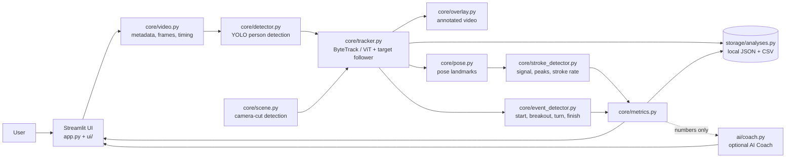

# SwimVision

**Turn ordinary swim race footage into measurable performance data.**

> Built for the 2026 Congressional App Challenge.
> **Status: Phase 2 of 10 complete** (upload, swimmer selection, swimmer tracking). No stroke or race metrics exist yet. See the [Roadmap](#roadmap).

## Problem

Competitive swimmers often have videos of their races, but a normal video only shows *what* happened. To understand *why* time was gained or lost, a swimmer or coach has to replay footage by hand and manually measure strokes, breakouts, turns and splits. Professional sports-analysis systems that automate this are expensive or inaccessible.

## Solution

SwimVision lets a swimmer upload an ordinary race video and uses computer vision to measure the race: stroke count, stroke rate, start/breakout timing, turns and finish. Every number shown comes from the video, from user input, or from a calculation the app performs. **Nothing is hard-coded or simulated.**

## Features

| Feature | Status |
|---|---|
| Race setup (stroke, distance, pool) | ✅ Phase 1 |
| Video upload (MP4 / MOV / AVI / M4V / MKV), real FPS / frames / duration / resolution | ✅ Phase 1 |
| Person detection with numbered boxes; user picks the swimmer | ✅ Phase 2 |
| Manual box fallback when the swimmer is not detected | ✅ Phase 2 |
| Swimmer tracking (ID, box, centre, timestamp, confidence per frame) | ✅ Phase 2 |
| Honest tracking-loss reporting (lost / low-confidence / re-acquired segments, camera cuts) | ✅ Phase 2 |
| Annotated tracking video + position-over-time graph + CSV export | ✅ Phase 2 |
| Pose estimation | Phase 3 |
| Freestyle stroke count and stroke rate | Phase 4 |
| Start / breakout / finish with manual correction | Phase 5 |
| Dashboard, event clips, full analysed video | Phase 6 |
| Turns and distance calibration | Phase 7 |
| Race comparison | Phase 8 |
| Optional AI Coach (explains measured data only) | Phase 9 |
| Validation mode (manual ground truth vs. SwimVision) | Phase 10 |

## How swimmer tracking works (Phase 2)

1. **Mark the swimmer with checkpoints.** Drag a box around your swimmer on a frame (a zoomed view lets you check it). Add more checkpoints where the swimmer resurfaces - after the dive and after each turn. Underwater the swimmer is invisible in the picture, so no tracker (and no person) can follow them there; a checkpoint tells the app who to follow once they reappear. Optionally a YOLO person detector can propose numbered boxes, but on pool footage it mostly finds spectators.
2. **Track.** The default method is **Segment Anything 2** (Meta's SAM 2.1, via Ultralytics). It segments the swimmer's outline and keeps a *memory* of how they looked over many earlier frames, so it copes with the swimmer changing shape (standing -> diving -> swimming) and with a handheld camera that pans and zooms. Each checkpoint starts a fresh SAM 2 run that lasts until the next checkpoint or camera cut; the earliest one also runs backwards.
   - **"Is it really swimming?" check** (`core/camera_motion.py`). Camera movement is measured from background points (optical flow + RANSAC). Subtracting it gives the box's motion *through the pool*. A box that does not move through the pool (sideways, or growing/shrinking as the swimmer heads to/from the camera) for 2 s is flagged **not moving** - correct on the starting block, but in the race it means the box is probably on a spectator. We added this after watching SAM 2 jump from a diving swimmer to a spectator behind the blocks and "track" them for 11 s.
   - The first second after the target reappears from a gap is flagged **found again - check it is your swimmer**.
   - Older methods remain in *Advanced settings*:
   - **YOLO + ByteTrack / BoT-SORT** links detections over time. On top of it, SwimVision's own *target follower* (`core/tracker.py`) decides which track is your swimmer. A new track ID is accepted only if it clearly overlaps where the swimmer just was, and the frame is flagged **re-acquired**. If two people could both be the swimmer, the swimmer is reported **lost** rather than guessed.
   - **OpenCV ViT visual tracker** follows your box directly. It reports a real similarity score, and SwimVision rejects boxes that suddenly collapse or balloon.
   - In *Automatic* mode, if YOLO tracking finds the swimmer in under 50% of frames, the visual tracker is tried as well, and whichever located the swimmer more is shown (with a note saying so).
3. **Tracking always says why it stopped.** Each stop is reported with its time and reason (match score fell, box became implausible, camera cut...), so a "swimmer found in less than half of the frames" warning is never a mystery.
4. **Camera cuts stop tracking.** If the video cuts to a different camera shot, tracking ends there and says so. A tracker must not follow "someone" into a new shot.
5. **Nothing is invented.** Lost frames have *no* coordinates. The tracking table (`data/tracking/<id>_tracking.csv`) has one row per analysed frame with `status` = `tracked` / `reacquired` / `not_moving` / `lost` (plus `low_confidence` for the older methods). The app explains each status in plain words.

Timing always comes from frame index ÷ the video's real FPS. For videos above 30 fps every *n*-th frame is analysed (60 fps -> every 2nd), but timestamps stay exact.

## Architecture



Implemented so far: `video`, `detector`, `tracker`, `scene`, `overlay`, `geometry`, `storage`, `ui`. The others (`pose`, `stroke_detector`, `event_detector`, `metrics`, `ai`) are placeholders until their phase. The dotted line: the optional AI Coach receives only calculated numbers, never video.

**Design rules**

- `core/` contains analysis logic and has no Streamlit code, so it can be tested and reused.
- `ui/` only displays results and collects input.
- **All timing is derived from frame index and the video's real FPS.** No wall-clock timers.
- Expected failures raise `SwimVisionError` subclasses with user-readable messages; the UI shows the message instead of a traceback.
- Pure logic (target following, segments, geometry, cut detection) is separated from model-running code so it can be unit-tested.

## Technology stack

Python 3.12, Streamlit, OpenCV (optical flow, ViT tracker), Ultralytics (SAM 2.1 video segmentation, YOLO11 + ByteTrack/BoT-SORT), PyTorch, NumPy, SciPy, Pandas, Plotly, FFmpeg (bundled via `imageio-ffmpeg`), pytest.
Planned: MediaPipe Pose (Phase 3), optional OpenAI/Gemini text API (Phase 9).

**Python version:** use **3.12**. Python 3.14 is not recommended because PyTorch/Ultralytics/MediaPipe wheels for it lag behind.

## Installation

Windows PowerShell:

```powershell
cd SwimVision
py -3.12 -m venv .venv
.\.venv\Scripts\Activate.ps1
pip install -r requirements-dev.txt
```

macOS / Linux:

```bash
python3.12 -m venv .venv
source .venv/bin/activate
pip install -r requirements-dev.txt
```

No separate FFmpeg install is needed.

### GPU acceleration (optional, strongly recommended with an NVIDIA GPU)

`pip install` gives the CPU build of PyTorch, which works but is slow for tracking whole videos. With an NVIDIA GPU, install the CUDA build *before* the requirements:

```powershell
pip install torch torchvision --index-url https://download.pytorch.org/whl/cu128
pip install -r requirements-dev.txt
```

SwimVision shows which device it is using in *Advanced detection & tracking settings*.

### First run needs internet (once)

The first time you use detection/tracking, pretrained model files are downloaded into `models/` (SAM 2.1 base ≈ 155 MB and YOLO weights ≈ 20-50 MB from the Ultralytics GitHub releases; a 0.7 MB OpenCV tracker model). SAM 2 needs a graphics card to be practical: on an RTX 4070 Ti SUPER (half precision, ~16 frames/s) a 55 s 30 fps race takes about 1.5-2 minutes; on a CPU it is far slower. Tracking runs in a background thread, so refreshing the page or clicking elsewhere does not cancel it. **Only model files are downloaded - your video is never uploaded.**

## Running locally

```powershell
streamlit run app.py
```

Open <http://localhost:8501>. Run the tests with `pytest`.

Developer tool (no UI): inspect detection and tracking from the command line.

```powershell
python -m scripts.dev_track my_race.mp4 --frame 60                  # list detected people
python -m scripts.dev_track my_race.mp4 --frame 60 --select 2       # track person #2
python -m scripts.dev_track my_race.mp4 --frame 60 --box 100 200 400 300 --method visual
```

Optional: copy `.env.example` to `.env` to configure an AI Coach key later. The app works without it.

## Supported video assumptions (V1)

- One swimmer analysed (chosen by the user)
- Swimmer clearly visible
- Camera roughly **side-on** to the pool and **fairly stable**, with no cuts to other cameras
- **Freestyle first**; other strokes are listed as experimental
- Short races (25 or 50) for initial testing

## Current limitations

- **No swimming metrics yet.** Phase 2 only locates the swimmer; stroke count, rate, events and times arrive in later phases.
- **Pretrained person detectors do not find swimmers in the water.** Measured on real pool footage: COCO YOLO11 (n/s/m/l, several image sizes) found 0 swimmers in 16 tests - every detection was a spectator. An open-vocabulary detector (YOLO-World) was inconsistent. SwimVision therefore relies on user checkpoints + SAM 2.
- **The dive, underwater phases and turns cannot be tracked automatically.** The swimmer is hidden by water and splash, and on handheld footage the camera often zooms out at the same moment, so the swimmer looks completely different when they resurface. Measured on the developer's real 50 SCY freestyle video: from one checkpoint on the block SAM 2 followed the dive through the air, then lost the swimmer at water entry; from a checkpoint after the breakout it followed them to the turn, lost them during the underwater turn, found them again by itself afterwards, and lost them again when they were ~15 px wide at the far end. Extra checkpoints fix the gaps; the app says where to add them.
- **The "not moving" check is a warning sign, not proof.** It can miss a spectator who walks, and it can briefly flag a real swimmer who is tiny and far away.
- A detector fine-tuned on labelled swimmer frames, combined with lane-rope detection (each swimmer stays in their lane), is the most promising way to need fewer checkpoints. Research systems do this (e.g. the SwimTrack dataset/benchmark and Centrale Lyon's `swimmers_detection`, DeepDASH head detection).
- **Development testing so far used old, grainy open-water swimming films** (public domain, with camera cuts) plus synthetic videos with known motion. **It has not yet been evaluated on modern side-view pool race footage.** Pool-footage accuracy will be measured in the validation phase; no accuracy figures are claimed here.
- Tracking positions are in **pixels**, not metres/yards (needs calibration, Phase 7).
- Camera cut detection is deliberately cautious: a very sudden brightness change or whip-pan may be treated as a cut and stop tracking (the app tells you when it does).
- Non-MP4/H.264 uploads (MOV, AVI, HEVC) are shown through a re-encoded preview; the original file is always what is analysed.
- Frame count is verified by decoding. Variable-frame-rate videos use the container's average FPS.
- Upload limit is 1 GB (`.streamlit/config.toml`).

## Privacy

- **All video processing happens locally on your computer.**
- Videos are stored in `uploads/`, which is git-ignored. Unsaved uploads older than one hour are deleted automatically at start-up.
- The only network use is the one-time download of model files.
- The optional AI Coach (Phase 9) will receive only calculated numbers and text such as stroke count and timings. **It will never receive video or frames.** If no API key is set, the AI Coach is simply disabled.
- Never commit swim videos (especially of children). `.gitignore` blocks common video extensions and the `uploads/`, `outputs/`, `data/` and `models/` contents.

## AI use disclosure

Generative AI was used to help write this project. See [AI_USAGE.md](AI_USAGE.md) for specifics.
At run time, generative AI is used only for the optional coaching text, and only on measured numbers.

## Roadmap

1. **Phase 1 ✅** Setup, upload, metadata, playback
2. **Phase 2 ✅** Swimmer detection, selection, tracking, annotated video
3. Phase 3: Pose estimation
4. Phase 4: Stroke signal, stroke count, stroke rate
5. Phase 5: Start / breakout / finish (hybrid auto + manual)
6. Phase 6: Dashboard, clips, overlay video
7. Phase 7: Turns, distance calibration
8. Phase 8: Race comparison
9. Phase 9: AI Coach
10. Phase 10: Validation, performance tuning, documentation

## Future improvements

Other strokes and camera angles, overhead/underwater views, re-selecting the swimmer after a camera cut, multi-swimmer analysis, a trained custom model if pretrained models prove insufficient (only after measuring that they are).
